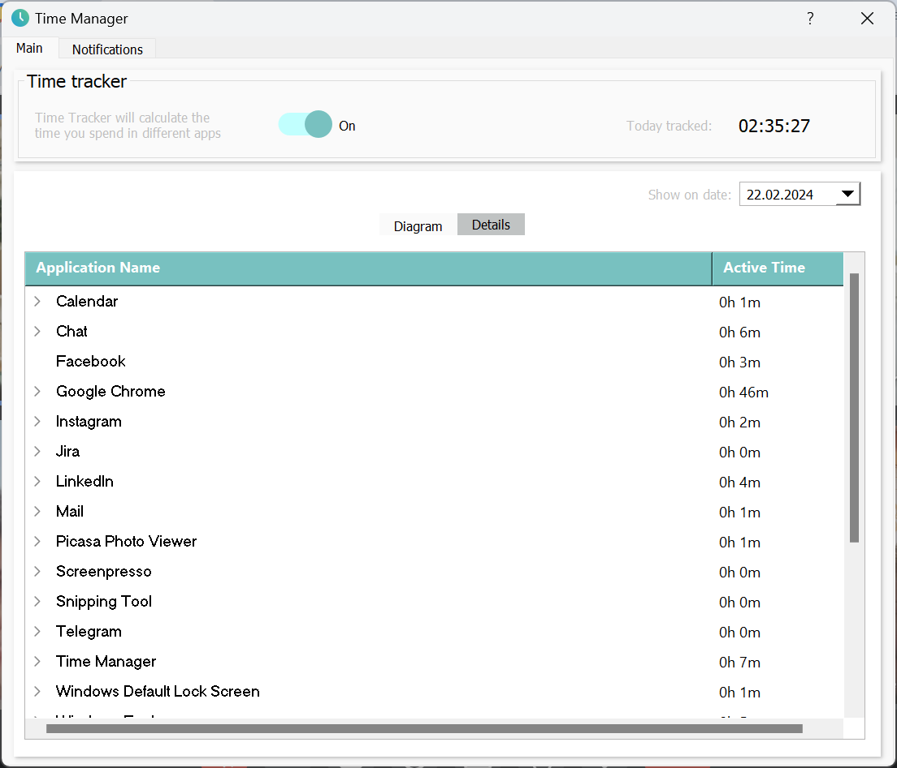

# Project Name

Time Manager 

-----------------------------------------------------------------------------------------------------------------

## Overview

This project was created to track the time spent in different PC apps. The program takes into consideration cursor position, window position and printscreen differences. You can view not only today’s logs but also the logs for the last 8 days. 

The first tab (Main) shows a diagram of the tracked apps and a table with the detailed list of apps:

The second tab (Notifications) is dedicated to the Break Timer:

You can set up the time after which the application will notify you to have a break. However, the Timer tracks your activity in real-time: if you are not working on the computer for 3 minutes (you can also set up this time), the Timer resets. When you start working on the computer again, the Timer will automatically start from the beginning.

In the break alarm window, you can choose to postpone the notification for 3 minutes or click OK. OK means that the app gives you 1 min to stop working:

If you don’t do this, the Timer starts again

The app can be rolled up to the tray so it will not bother you. 

---------------------------------------------------------------------------------------------------------------

## Moduls/programs used

- Python 3.x
- PyQt5
- json
- ctypes 
- datetime
- time
- psutil
- sys 
- PIL
- cv2
- os
- re

------------------------------------------------------------------------------------------------------------------

## Requirements 

Supported Operating Systems: Windows

-----------------------------------------------------------------------------------------------------------------

## Usage

1. Run the program by executing the `src\timemanager.py` file.
2. Use the tabs for time tracking and setting break reminders.
3. Enjoy your enhanced productivity!
